包括ElGamal数字签名、Schnorr数字签名、RSA-PSS、DSA数字签名。

# 一、ElGamal数字签名

## 1. 算法原理

ElGamal加密方案使用用户的公钥进行加密，使用用户的私钥进行解密。ElGamal数字签名方案则是使用私钥进行加密，公钥进行解密的。

## 2. 算法流程

密钥产生流程如下：

```flow
st=>start: 生成素数q和及其原根α
op1=>operation: 生成随机数x，1<x<q-1
op2=>operation: 计算y=α^x % q
out=>inputoutput: 公钥x
私钥(q,α,y)
st->op1->op2->out
```

伪代码如下：

```c
generateKey(qLen, aLen):
q,a=generator(qLen,aLen);
x = random(2, q-2);
y = a^x % q
return x, y
```

签名流程如下：

```flow
st=>start: 输入消息hash值m，密钥q,a,x
op1=>operation: 选择随机数k，1<=k<=q-1，gcd(k,q-1)=1
op2=>operation: 计算s1=g^k % p
op3=>operation: 计算s2=k^(-1) * (m-x*s1) % (q-1)
out=>inputoutput: 签名(s1,s2)
st->op1->op2->op3->out
```

伪代码如下：

```c
sign(m, q, a, x):
k = random(1,q-1);
while(gcd(k, q-1) != 1)
    k = random(1,q-1);
s1 = a^k % q;
s2 = k^(-1) * (m-x*s1) % (q-1);
return s1,s2
```

验证签名流程如下：

```flow
st=>start: 输入消息M，签名s1,s2，公钥q,a,y
op1=>operation: 计算hash值m
op2=>operation: 计算v1=g^m % p
op3=>operation: 计算v2=y^s1 * s1^s1 % q
out=>inputoutput: 返回v1=v2?
st->op1->op2->op3->out
```

伪代码如下：

```c
verify(m,s1,s2,q,a,y):
m=Hash(M);
v1=g^m % p;
s2 = k^(-1) * (m-x*s1) % (q-1);
return v1==v2;
```

## 3. 测试样例及运行结果

签名：

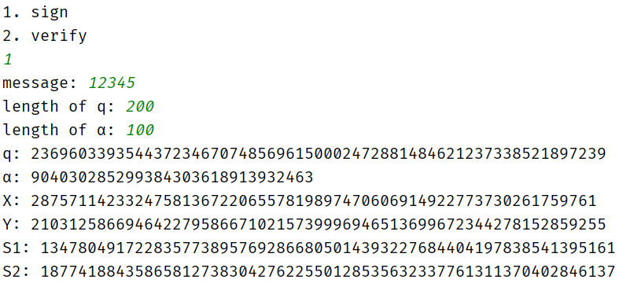

正确签名验证：

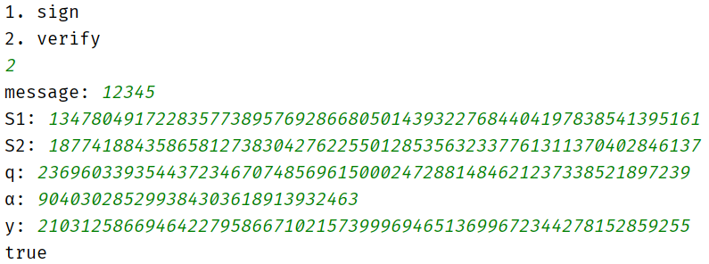

将S1的最后一位改为0，未通过验证：

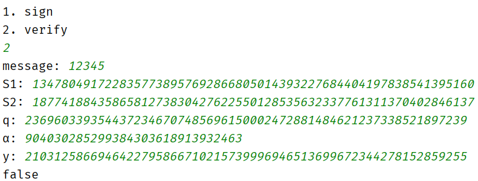

## 4. 总结

ElGamal数字签名方案是基于离散对数问题的。主要困难在于选择素数q的原根，这里采用了网上的一种算法[构造一个大素数条件下的本原元（JAVA实现）](https://blog.csdn.net/qq_37685156/article/details/88190088)，但是在生成非常大的数（如1024位）时效率极低。

# 二、Schnorr数字签名

## 1. 算法原理

Schnorr数字签名方案也是基于离散对数的。Schnorr方案将生成签名所需的消息计算量最小化。生成签名的主要工作不依赖于消息，可以在处理器空闲时执行。

## 2. 算法流程

密钥产生流程如下：

```flow
st=>start: 开始
op1=>operation: 选择素数p、q，使得q是p-1的素因子
op2=>operation: 选择整数α，使得α^q=1mod p
op3=>operation: 选择随机整数s，0<s<q
op4=>operation: 计算v= α^(-s) % p
out=>inputoutput: 全局公钥参数p,q,α
私钥s
公钥v
st->op1->op2->op3->op4->out
```

伪代码如下：

```c
generateKey():
q = random();
k = random();
while(!isPrime(q*k+1))
    k = random();
	p = k*q+1;
a = random()^k % p;
s = random(1,q-1);
v = a^(-s);
return a,p,q,s,v;
```

签名流程如下：

```flow
st=>start: 输入消息m，密钥a,p,q,s
op1=>operation: 选择随机数r(0<r<q)
op2=>operation: 计算x=g^ % p
op3=>operation: 计算 e=h(x||m)
op4=>operation: 计算y=r+se mod q
out=>inputoutput: 签名(e,y)
st->op1->op2->op3->op4->out
```

伪代码如下：

```c
sign(a,p,q,s):
r = random(1,q-1);
e = hash(x||m);
y = r+se mod q
return e,y;
```

验证签名流程如下：

```flow
st=>start: 输入消息m，签名e,y，公钥a,q,v
op1=>operation: x = a^y * v^e % p
op2=>operation: 计算e'=Hash(m||x)
out=>inputoutput: 返回e=e'?
st->op1->op2->out
```

伪代码如下：

```c
verify(m,e,y,a,p,v):
x = a^y * v^e % p
return e==hash(m||x);
```

## 3.测试样例及运行结果

签名：

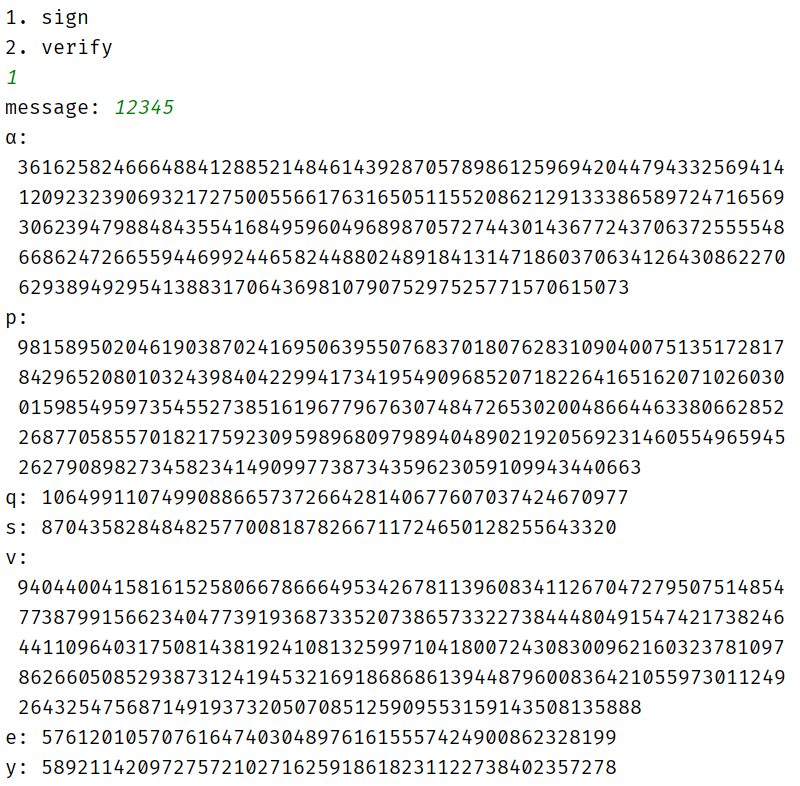

正确签名验证：

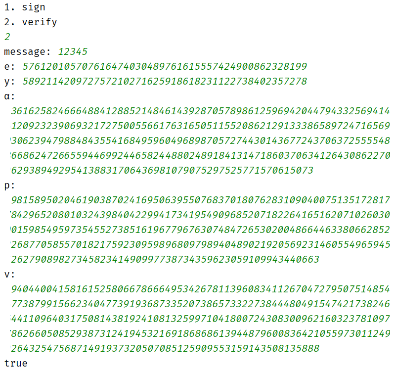

将e的最后一位改为8，未通过验证：

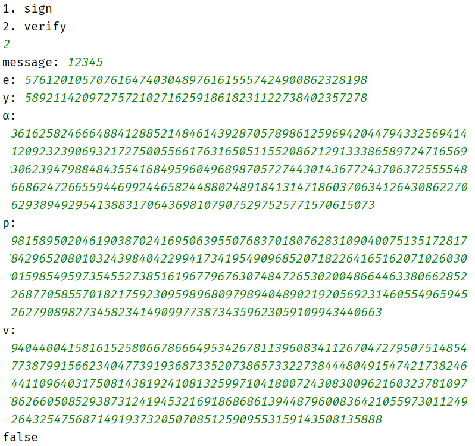

## 4. 总结

这个实验中的主要问题为选择符合条件的p,q,α。要使q为p-1的素因子，可以先生成素数q，然后随机生成另一个因子k，直到kq+1=p为素数。对于α，$x^{p-1}≡1\pmod p$，而$p-1=kq$，所以$(x^k)^q≡1\pmod p$，随机生成一个x，然后令$α=x^k$即可。

# 三、 RSA-PSS

## 1. 算法原理

PSS (Probabilistic Signature Scheme)私钥签名流程的一种填充模式。目前主流的RSA签名包括RSA-PSS和RSA-PKCS#1 v1.5。相对应PKCS（Public Key Cryptography Standards）是一种能够自我从签名，而PSS无法从签名中恢恢复原来的签名。openssl-1.1.x以后默认使用更安全的PSS的RSA签名模式。

## 2. 算法流程

签名流程如下：

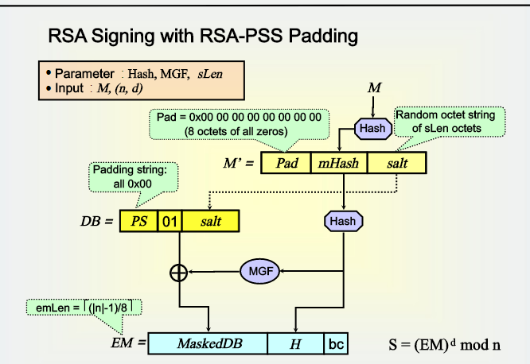

伪代码如下：

```c
encode(m,embits)://消息编码
emLen = [emBits/8];
mHash = H(m);
salt = random(sLen);
m2 = padding1||mHash||salt;
h = H(m2);
db = padding2||salt;
dbMask = MGF(h,emLen-hLen-1);
maskedDB = db^dbMask;
maskedDB[0][0 to 8emLen-emBits] = 0;
return em = maskedDB||h||0xbc;

sign(em,d,n)://签名
m = toInt(em);
s = m^d % n;
return s;
```

验证签名流程如下：

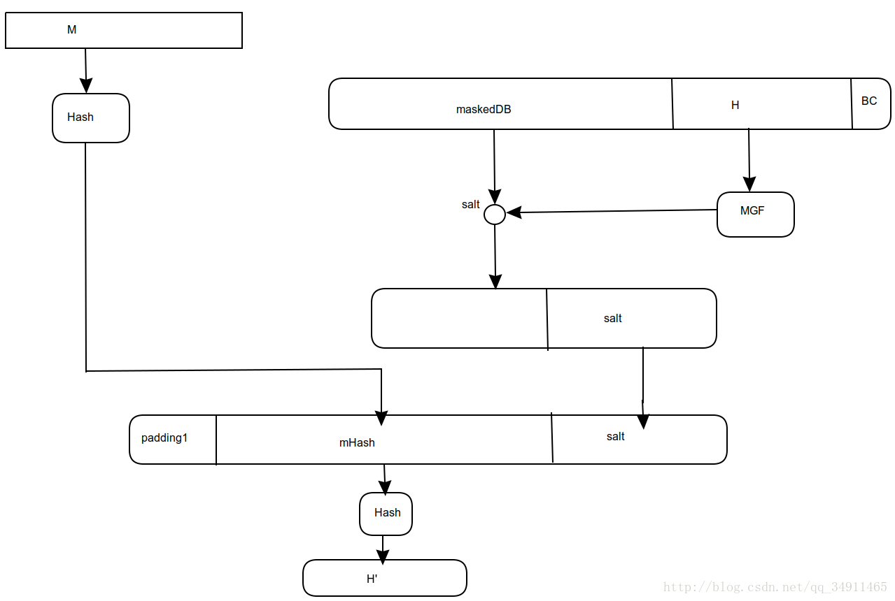

伪代码如下：

```c
decode(s,e,m)://解密
m = s^e % n;
em = toBytes(m);
return em;

verify(m,em1,emBits)://验证签名
emLen = [emBits/8];
mHash = H(m);
if (emLen < hLen+sLen+2)
    return false;
if (em[emLen] != 0xbc)
    return false;
maskedDB = em的左emLen-hLen-1字节;
h = em接下来hLen字节;
if(maskedDB[0][0 to 8emLen-emBits] != 0)
    return false;
dbMask = MGF(h,emLen-hLen-1);
db = maskedDB^dbMask;
db[0][0 to 8emLen-emBits] = 0;
if(db[0 to emLen-hLen-sLen-1] != padding2)
    return false;
salt = db右sLen字节;
m2 = padding1||mHash||salt;
h2 = H(m2);
return h==h2;
```

## 3.测试样例及运行结果

签名：

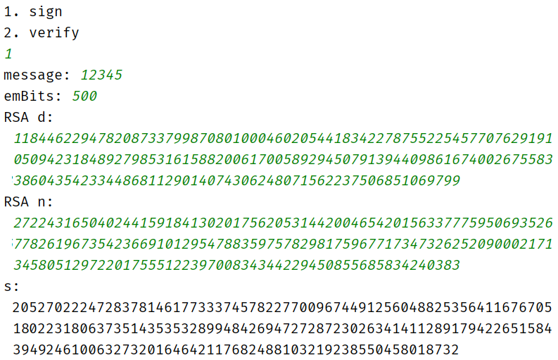

正确签名验证：


将s的最后一位改为1，未通过验证：

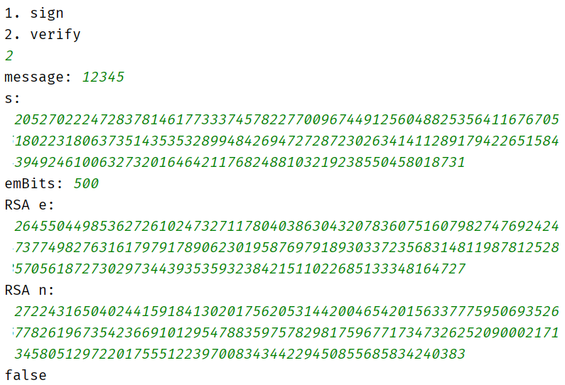

## 4. 总结

RSA-PSS算法要对消息进行重新编码，生成新的消息摘要，然后对消息摘要加密。这个实验中遇到的问题是生成的摘要可能前几个字节为0，这样在加密是会被去掉，所以验证时要根据emBits来将摘要补充完整。由于算法中会产生随机数，所以这个bug不容易复现，需要耐心调试。

# 四、DSA数字签名

## 1. 算法原理

DSA的安全性主要依赖于有限域上离散对数问题的难解性，是ElGamal签名算法的变种 。

## 2. 算法流程

密钥产生流程如下：

```flow
st=>start: 开始
op1=>operation: 选择素数p，且2^(L-1)≤p≤2^L（其中512≤L≤1024，且L是64的倍数）
op2=>operation: 选择素数q,q是p-1的一个素因子，2^(N-1)≤p≤2^N
op3=>operation: 选择g，g = h^((p-1)/q) mod p，1≤h≤(p-1)
op4=>operation: 选择x，0<x<q
op5=>operation: 计算y=g^x % p
out=>inputoutput: 全局公钥p,q,g
私钥x
公钥y
st->op1->op2->op3->op4->op5->out
```

伪代码如下：

```c
generateKey(l,n):
q = random(n);
k = random(l-n);
while(!isPrime(q*k+1))
    k = random();
	p = k*q+1;
g = h^k % p;
x = random(1,q-1);
y = g^x % p;
return p,q,g,x,y;
```

签名流程如下：

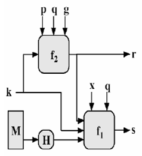

伪代码如下：

```c
sign(m,p,q,g,x):
k = nextK();
r = g^k % p % q;
s = k^(-1) * (H(m)+xr) % q;
return r,s;
```

验证签名流程如下：

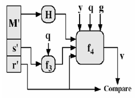

伪代码如下：

```c
verify(m,r,s,q,g,y):
w = s^(-1) % q;
u1 = H(m)*w % q;
u2 = r*w % q;
v = g^u1 * y^u2 % p % q;
return v == r;
```

## 3.测试样例及运行结果

签名：

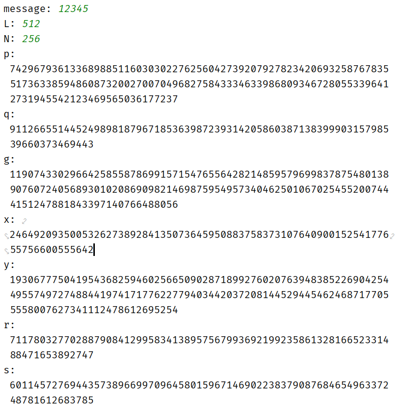

正确签名验证：

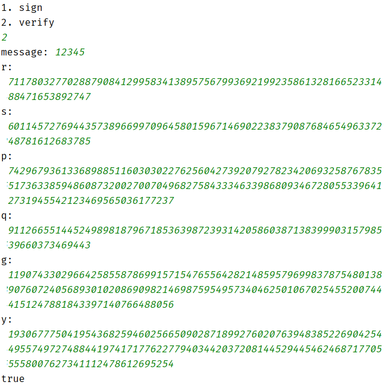

将r的最后一位改为6，未通过验证：

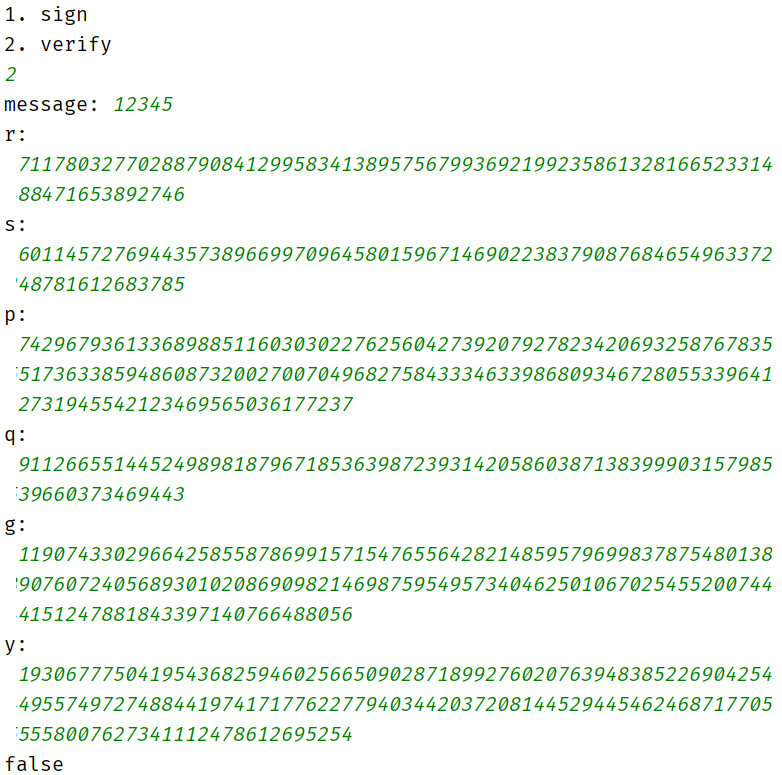

## 4. 总结

由于DSA是ElGamal算法的变种，所以遇到的困难也是p,q的选择，已经在ElGamal算法中解决了。还有一个问题是教材上有错误，$g=h^{(p-1)/q}\mod p$写成了$g=h(p-1)/q\mod p$，耽误了很长时间。

# 五、收获与建议

数字签名主要用于对数字消息进行签名，以防消息的冒名伪造或篡改，也可用于通信双方的身份鉴别。这次实验遇到的困难都是关于密钥选择的，满足条件的数不容易找到，这也可以从一方面说明这些数字签名方案的强度。